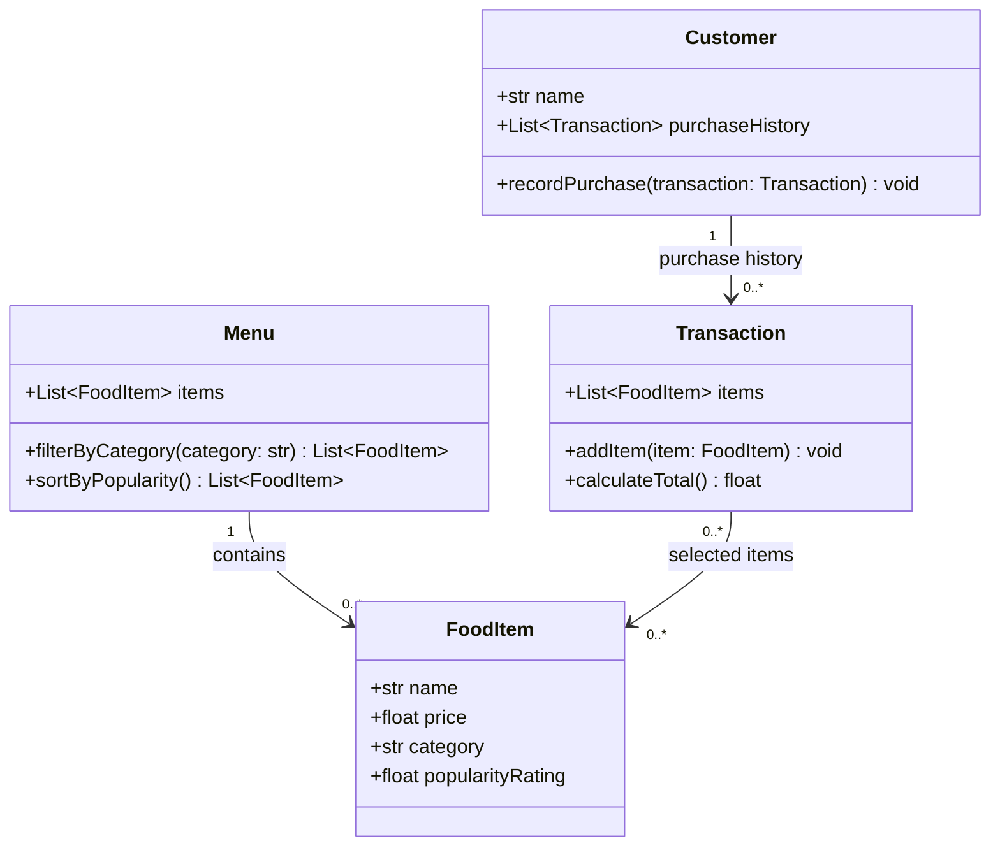

# ByteBites Final UML Design

Revised by Copilot Chat with bytebites_spec.md and ByteBites_Design_Reference.md (behavioral instructions) attached.

```mermaid
classDiagram
	class Customer {
		+str name
		+List~Transaction~ purchaseHistory
		+recordPurchase(transaction: Transaction) void
	}

	class FoodItem {
		+str name
		+float price
		+str category
		+float popularityRating
	}

	class Menu {
		+List~FoodItem~ items
		+filterByCategory(category: str) List~FoodItem~
		+sortByPopularity() List~FoodItem~
	}

	class Transaction {
		+List~FoodItem~ items
		+addItem(item: FoodItem) void
		+calculateTotal() float
	}

	Customer "1" --> "0..*" Transaction : purchase history
	Menu "1" --> "0..*" FoodItem : contains
	Transaction "0..*" --> "0..*" FoodItem : selected items
```
