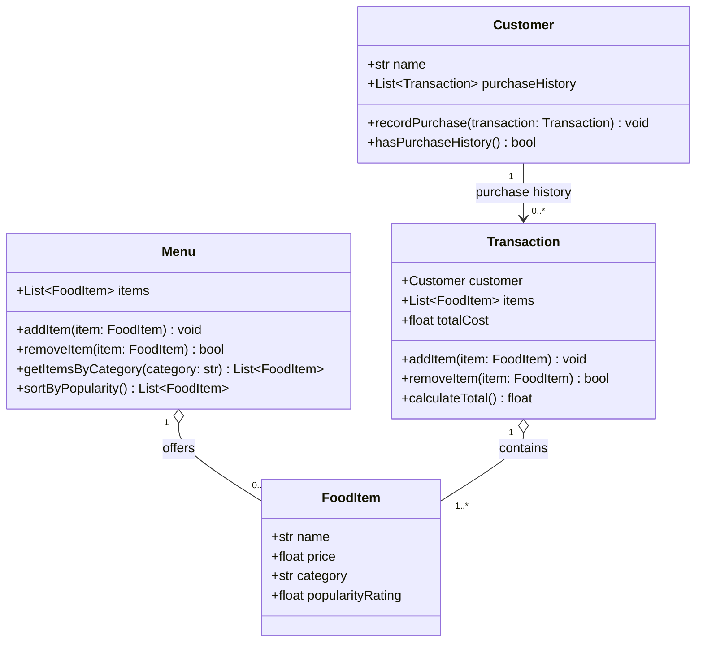

# First UML Draft (from Copilot)

Generated by Copilot Chat with bytebites_spec.md as context, before any behavioral instructions.

```mermaid
classDiagram
	class Customer {
		+str name
		+List~Transaction~ purchaseHistory
		+recordPurchase(transaction: Transaction) void
		+hasPurchaseHistory() bool
	}

	class FoodItem {
		+str name
		+float price
		+str category
		+float popularityRating
	}

	class Menu {
		+List~FoodItem~ items
		+addItem(item: FoodItem) void
		+removeItem(item: FoodItem) bool
		+getItemsByCategory(category: str) List~FoodItem~
		+sortByPopularity() List~FoodItem~
	}

	class Transaction {
		+Customer customer
		+List~FoodItem~ items
		+float totalCost
		+addItem(item: FoodItem) void
		+removeItem(item: FoodItem) bool
		+calculateTotal() float
	}

	Customer "1" --> "0..*" Transaction : purchase history
	Menu "1" o-- "0..*" FoodItem : offers
	Transaction "1" o-- "1..*" FoodItem : contains
```
